<!-- ════════════════════════  HERO  ════════════════════════ -->

<a href="https://alfredonatal.com">
  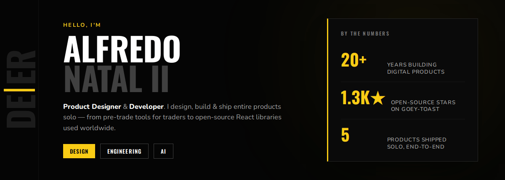
</a>

<!-- ════════════════════════  SOCIAL  ════════════════════════ -->

  <a href="https://github.com/anl331">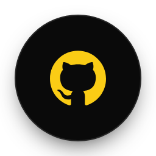</a>
  &nbsp;
  <a href="https://www.linkedin.com/in/alfredonatal/">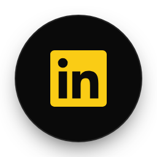</a>
  &nbsp;
  <a href="https://x.com/_itsanl">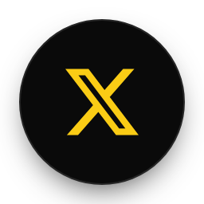</a>
  &nbsp;
  <a href="https://alfredonatal.com">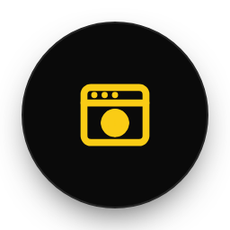</a>

<!-- ════════════════════════  ABOUT  ════════════════════════ -->

## ABOUT

I'm a product designer and developer in New York, about twenty years in. I build whole products by myself: the design, the code, the launch. These days I lean on AI agents to handle the work that used to take a team.

> *"I make things that feel right to use."*

- Building AI-native SaaS solo at Natal Ventures right now
- My open-source toast library, goey-toast, runs on a few thousand projects
- Ask me about LLM agents, design systems, or taking an idea from nothing to live
- English and Spanish. Open to product designer / engineer roles

<!-- ════════════════════════  WHAT I DO  ════════════════════════ -->

## WHAT I DO

<!-- ════════════════════════  FEATURED OSS  ════════════════════════ -->

## FEATURED OPEN SOURCE

  
  
  

<!-- ════════════════════════  VENTURES  ════════════════════════ -->

## VENTURES &amp; PRODUCTS

### OEMPRO

<a href="https://oempro.io">
  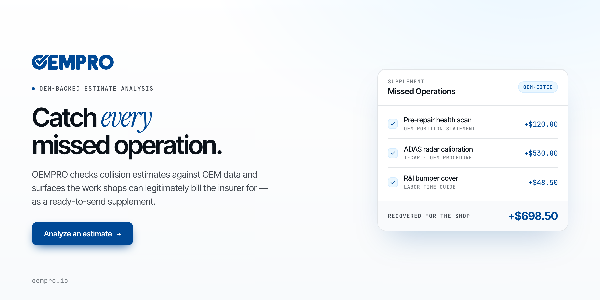
</a>

### TCT — Trading Confluence Tool

<a href="https://usetct.io">
  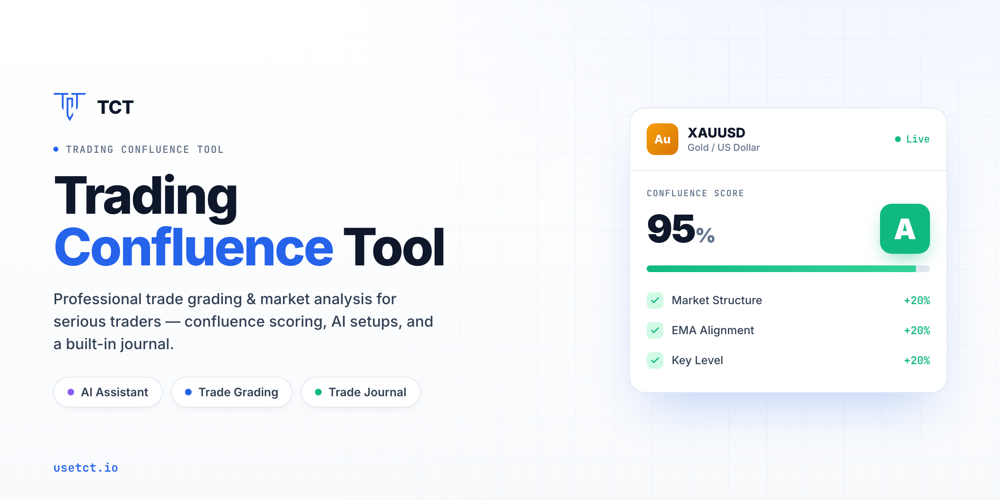
</a>

### Also shipped

**[ShotM8](https://shotm8.app)** — GLP-1 and peptide dose tracker, live on mobile with real users. **IDScannerAPI** — ID scanning and verification built on computer vision. **[goey-toast](https://github.com/anl331/goey-toast)** — open-source toast library.

<!-- ════════════════════════  MORE OSS  ════════════════════════ -->

## MORE OPEN SOURCE

<table>
  <tr>
    <td width="50%"><a href="https://github.com/anl331/goey-toast">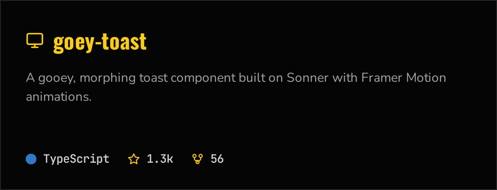</a></td>
    <td width="50%"><a href="https://github.com/anl331/gooey-search-tabs">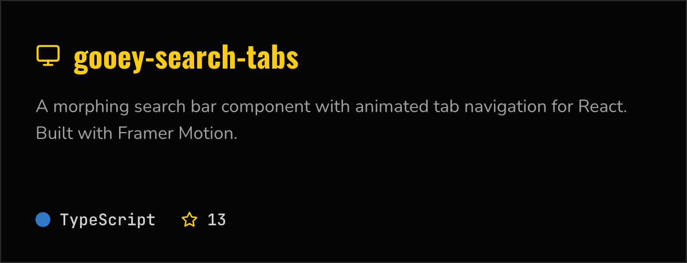</a></td>
  </tr>
  <tr>
    <td width="50%"><a href="https://github.com/anl331/vid-clipper">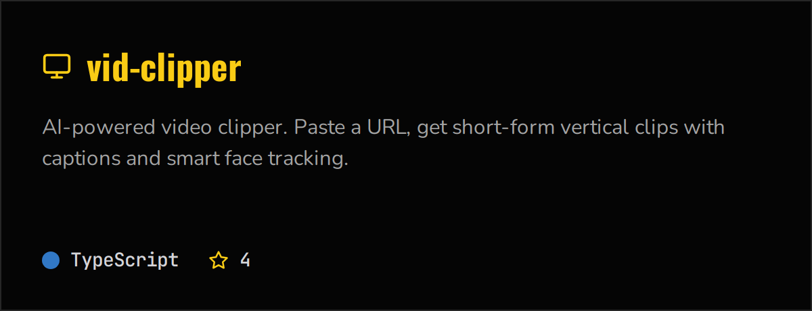</a></td>
    <td width="50%"><a href="https://github.com/anl331/chromakey-video-react">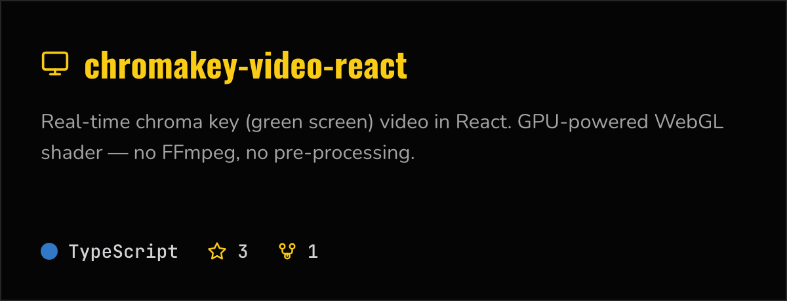</a></td>
  </tr>
</table>

<!-- ════════════════════════  FOOTER  ════════════════════════ -->

 

**Let's build something that feels right.**

