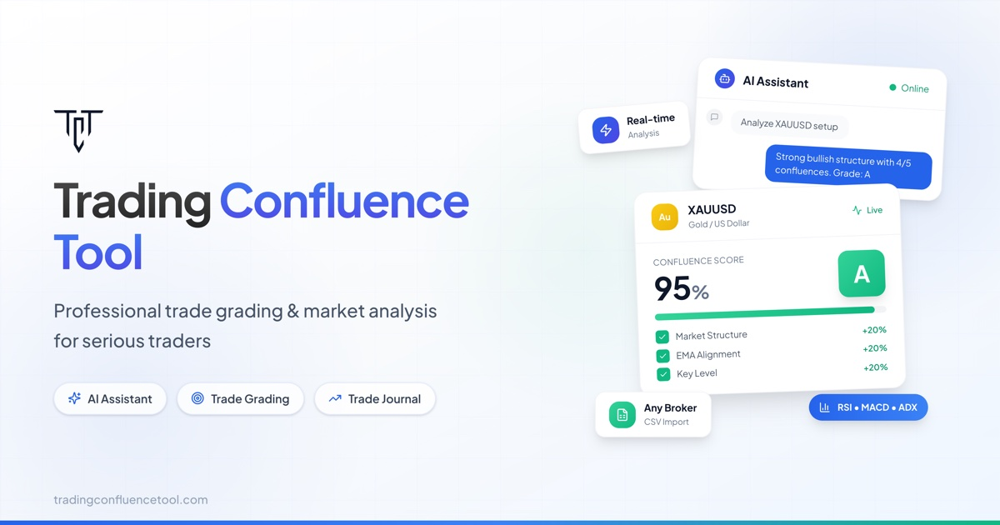
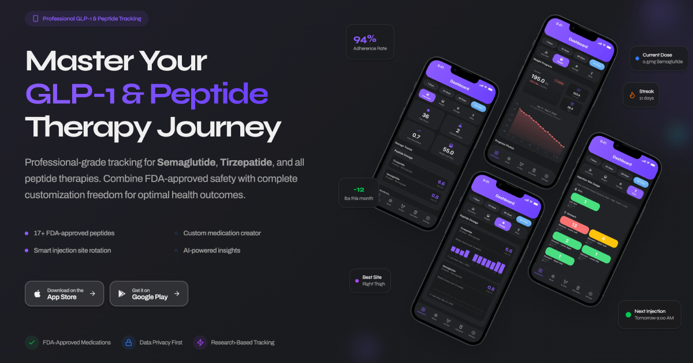

<!-- ════════════════════════  HERO  ════════════════════════ -->

<!-- ════════════════════════  SOCIAL  ════════════════════════ -->

  
  &nbsp;
  
  &nbsp;
  
  &nbsp;
  

<!-- ════════════════════════  ABOUT  ════════════════════════ -->

## ABOUT

Product **designer** and **developer** in **New York** with two decades building digital products. I design, build, and ship entire products solo — design taste plus full-stack engineering — using AI agents and multi-agent workflows to move at a pace that used to need a whole team.

> *“I make things that feel right to use.”*

- **Building** AI-native SaaS solo at **Natal Ventures**
- **Open-source author** — [`goey-toast`](https://github.com/anl331/goey-toast) runs on thousands of projects
- **Ask me about** LLM agents, design systems, or going zero-to-one
- English &amp; Spanish &nbsp;·&nbsp; **Open to Product Designer / Engineering roles**

<!-- ════════════════════════  WHAT I DO  ════════════════════════ -->

## WHAT I DO

<!-- ════════════════════════  FEATURED OSS  ════════════════════════ -->

## FEATURED OPEN SOURCE

  
  
  

<!-- ════════════════════════  VENTURES  ════════════════════════ -->

## VENTURES &amp; PRODUCTS

**Also:** [`IDScannerAPI`](https://alfredonatal.com) — government-ID scanning &amp; verification via computer vision &nbsp;·&nbsp; [`goey-toast`](https://github.com/anl331/goey-toast) — open-source morphing React toast.

<!-- ════════════════════════  MORE OSS  ════════════════════════ -->

## MORE OPEN SOURCE

  
  

  
  

<!-- ════════════════════════  FOOTER  ════════════════════════ -->

 

**Let's build something that feels right.**

